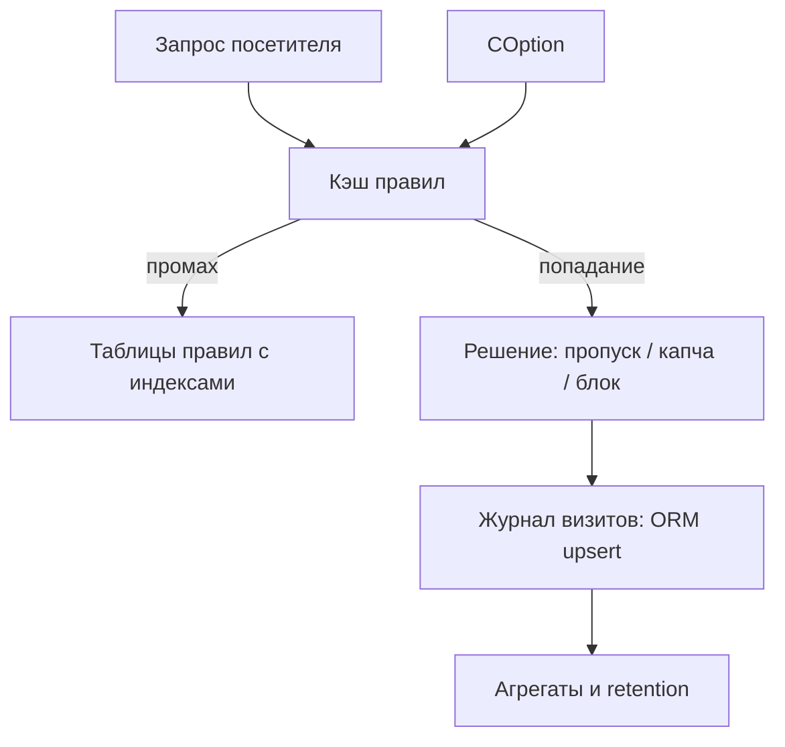

# Хранение данных в HL-блоках: оценка и план развития

## Краткий вывод

Highload-блоки — **оправданный выбор для быстрого старта** дистрибутивного модуля, но для модуля фильтрации трафика, который **пишет на каждом хите и читает правила на каждом запросе**, текущая схема становится узким местом. Оптимально — **гибридная модель**: горячий журнал и правила в собственных ORM-таблицах с индексами и кэшем, настройки — в `COption`.

## Что даёт HL-блоки (плюсы текущего решения)

1. **Установка без миграций.** HL-блоки создают таблицы сами — модуль ставится на любой Битрикс без ручного SQL.
2. **Готовая админка.** Списки и CRUD сделаны через `bitrix:highloadblock.list` и кастомные шаблоны — экономно по времени разработки.
3. **Экспорт/импорт, права, редактор UF-полей** доступны из коробки.
4. **Абстракция над СУБД** — работает и на MySQL, и на PostgreSQL.
5. **Чистое удаление модуля** — `deleteHlBlock()` корректно убирает данные.

## Где HL-блоки не подходят (проблемы по коду)

### 1. Горячий журнал визитов
- Запись происходит на **каждом** запросе: [`lib/handlers.php`](lib/handlers.php:107).
- [`IpList::addElement()`](lib/iplist.php:27) выполняет `SELECT` по всем записям IP и затем **`INSERT` новой строки** вместо `UPDATE`. Счётчик и «дата последнего визита» считаются некорректно: выборка идёт `ORDER BY ID ASC`, а не `DESC` ([`lib/iplist.php`](lib/iplist.php:40)).
- Таблица **не ограничена по размеру** и **не чистится** — журнал растёт бесконечно.
- У пользовательских полей HL **нет индексов** по `UF_IP_ID` → каждая выборка — фактически full scan.

### 2. Проверки правил на каждом хите
- Обработчик делает до **четырёх** обращений к HL-блокам на каждый запрос: реферер → маска → серый → чёрный ([`lib/handlers.php`](lib/handlers.php:37)).
- [`Mask::checkMask()`](lib/mask.php:57) при каждом вызове заново выгружает **все** активные маски ([`lib/mask.php`](lib/mask.php:22)) — без кэша.

### 3. Строковые enum вместо типов
- Активность масок — `'да'/'нет'` ([`lib/mask.php`](lib/mask.php:200)).
- Тип совпадения в фильтрах — строки вида `'Черный список'` ([`install/page/personal_filter/black_list/index.php`](install/page/personal_filter/black_list/index.php:18)).

### 4. Раздвоенное хранение настроек
- Время показа капчи — в HL-блоке `OptionsModule` ([`lib/config.php`](lib/config.php:119)).
- Список e-mail — в HL-блоке `OptionsEmail` ([`lib/email.php`](lib/email.php:120)).
- Ключи капчи — в `COption` ([`options.php`](options.php:21)).

### 5. Мёртвый код
- [`install/db/mysql/install.sql`](install/db/mysql/install.sql:1) создаёт `prohorov_ip_list`, `prohorov_ip_black_list`, `prohorov_ip_grey_list`, которые **нигде не используются** — поиск по репозиторию не находит обращений.

### 6. Массовые операции
- Импорт масок вставляет записи **по одной** без транзакции ([`lib/mask.php`](lib/mask.php:134)).

### 7. Права
- Списки рендерятся с `CHECK_PERMISSIONS => N` ([`install/page/personal_filter/index.php`](install/page/personal_filter/index.php:61)) — контроль доступа только на уровне страницы.

## Рекомендуемая целевая схема

## План работ по этапам

### Этап 0 — быстрые и безопасные улучшения
- [ ] Добавить индексы на поля поиска в HL-блоках: `UF_IP_ID` в `iplist`, `iplist_black`, `iplist_gray`, `UF_HTTP_REFERER`, `UF_MASC_START`.
- [ ] Ввести кэширование правил через управляемый кэш с тегом модуля и сброс тега при изменениях.
- [ ] Исправить [`IpList::addElement()`](lib/iplist.php:27): корректный upsert вместо вставки дубликатов, выборка последней записи `ORDER BY ID DESC`.
- [ ] Добавить настройку и механизм **retention** — удаление/агрегация визитов старше N дней.
- [ ] Удалить мёртвые таблицы из [`install/db/mysql/install.sql`](install/db/mysql/install.sql:1) и заменить метод установки БД.
- [ ] Включить осмысленную проверку прав вместо `CHECK_PERMISSIONS => N`.

### Этап 1 — настройки
- [ ] Перенести время показа капчи и список e-mail из HL-блоков в `COption`.
- [ ] Оставить HL-блоки только под данные, редактируемые как таблицы.

### Этап 2 — журнал визитов
- [ ] Вынести журнал в собственную ORM-таблицу на `DataManager` с индексами по IP и дате.
- [ ] Перейти на инкрементальный upsert и пакетную запись.
- [ ] Ввести агрегаты по дням и архивацию холодных данных.

### Этап 3 — массовые операции
- [ ] Батч-вставка масок с транзакцией ([`lib/mask.php`](lib/mask.php:117)).
- [ ] Асинхронная обработка больших импортов.

## Влияние на монетизацию
- **Производительность на высоком трафике** — главный технический риск продукта: без индексов и кэша модуль замедляет сайт тем сильнее, чем он нужнее.
- **HL как преимущество продажи** — установка «поставил и работает» без миграций; это стоит сохранить для списков правил.
- **Что добавит ценности клиенту**: настройки хранения и автоочистки журнала, экспорт/архив, метрики нагрузки, отчёт по сработавшим правилам.
