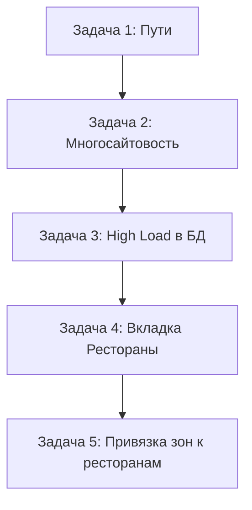

# План доработок модуля ldo.deliverymap

## Текущая архитектура

### Структура модуля
- **`install/index.php`** — установка: копирует admin/ldo_deliverymap → /bitrix/admin/ldo_deliverymap, создает таблицу `ldo_delivery_zones`
- **`admin/menu.php`** — пункт меню "Зоны доставки" → `/bitrix/admin/ldo_deliverymap/zones.php`
- **`admin/ldo_deliverymap/zones.php`** — админ-страница с Яндекс.Картой
- **`admin/ldo_deliverymap/zones.js`** — JS-класс `DeliveryZonesManager` (инициализация карты, полигоны, аккордеон, HighLoad)
- **`lib/DeliveryZoneTable.php`** — ORM-таблица зон доставки
- **`options.php`** — страница настроек (API key, координаты центра, зум)
- **`include.php`** — автозагрузка классов

### Таблица БД `ldo_delivery_zones`
| Поле | Тип | Описание |
|------|-----|----------|
| ID | int | PRIMARY KEY AUTO_INCREMENT |
| NAME | varchar(255) | Название зоны |
| PRICE | int | Цена доставки |
| COLOR | varchar(7) | Цвет полигона |
| COORDINATES | text | Координаты (JSON) |
| SORT | int | Сортировка |
| MIN_ORDER_PRICE | int | Мин. сумма заказа |
| FREE_DELIVERY_PRICE | int | Бесплатно от |
| DELIVERY_TIME_START | int | Время доставки от (мин) |
| DELIVERY_TIME_END | int | Время доставки до (мин) |
| HIGH_TYPE | int | Тип высокой нагрузки (0/1) |
| ACTIVE | char(1) | Активность Y/N |
| SITE_ID | varchar(2) | ID сайта |

---

## Задача 1: Пути в админке (исправление)

### Проблема
Модуль устанавливается в `/local/modules/ldo.deliverymap`, но `InstallFiles()` копирует admin/ в `/bitrix/admin/ldo_deliverymap`. 
В админке пути формируются вида `/bitrix/admin/ldo_deliverymap/zones.php` — это работает, 
НО если в админке есть ссылки на другие страницы (например, `admin.php?lang=ru&...`), 
то при клике на них подставляется путь от текущей страницы, и он может быть неверным.

### Решение
- В [`admin/menu.php:13`](local/modules/ldo.deliverymap/admin/menu.php:13) url уже правильный: `/bitrix/admin/ldo_deliverymap/zones.php`
- В [`options.php:15`](local/modules/ldo.deliverymap/options.php:15) используется `$APPLICATION->GetCurPage() . '?mid=' . $module_id` — это безопасно
- В [`zones.php:33-34`](local/modules/ldo.deliverymap/admin/ldo_deliverymap/zones.php:33-34) CSS и JS подключаются через абсолютные пути `/bitrix/admin/ldo_deliverymap/...` — ок
- Если есть кнопки типа "Назад" или "К списку" — убедиться, что они ведут на корректный URL

### Что нужно сделать (минимально)
1. Убедиться, что в [`zones.php`](local/modules/ldo.deliverymap/admin/ldo_deliverymap/zones.php) нет ссылок вида `./zones.php` без `/bitrix/admin/` — проверить строку 292 и подобные
2. При переустановке модуля — удалять старые файлы из `/bitrix/admin/ldo_deliverymap` перед копированием

---

## Задача 2: Многосайтовость (API KEY + координаты по сайтам)

### Проблема
Сейчас `options.php` хранит единые настройки для всех сайтов:
- `yandex_api_key` — один ключ для всех
- `default_lat`, `default_lng`, `default_zoom` — один центр для всех

### Решение
Хранить настройки с привязкой к SITE_ID.

**Формат хранения** (в опциях модуля):
```
Option::set('ldo.deliverymap', 'yandex_api_key_s1', '...');
Option::set('ldo.deliverymap', 'yandex_api_key_s2', '...');
```

**Изменения:**

1. [`options.php`](local/modules/ldo.deliverymap/options.php):
   - Добавить выбор сайта в начале (`CSite::GetList()`)
   - При выборе сайта — грузить его настройки
   - Добавить скрытое поле `site_id`
   - Ключи опций хранить с суффиксом `_` + SITE_ID

2. [`zones.php`](local/modules/ldo.deliverymap/admin/ldo_deliverymap/zones.php):
   - Сейчас `$currentSiteId = 's1'` — нужно получать из REQUEST (`$_GET['site_id'] ?? $_POST['SITE_ID'] ?? 's1'`)
   - data-аттрибуты карты (`data-api-key`, `data-default-lat` и т.д.) должны загружать настройки для выбранного сайта

3. [`zones.js`](local/modules/ldo.deliverymap/admin/ldo_deliverymap/zones.js):
   - Получать `siteId` из `map-data[data-site-id]`
   - Передавать `site_id` при AJAX-запросах

4. **Селектор сайта** — добавить выпадающий список сайтов в верхней части админ-страницы (над картой).

---

## Задача 3: Высокая нагрузка — сохранение в БД

### Текущее состояние
Галка "Высокая нагрузка" и поле "Время доставки (минут)" уже есть в HTML, но:
- В [`zones.js:468-556`](local/modules/ldo.deliverymap/admin/ldo_deliverymap/zones.js) — есть метод `initHighLoadFeature()` с UI-логикой, но **нет отправки на сервер**
- В БД есть поле `HIGH_TYPE` для хранения (0/1)
- Нет поля для хранения дополнительного времени высокой нагрузки

### Решение

1. **Добавить поле `HIGH_LOAD_TIME` в БД** (или переиспользовать существующие):
   - Можно добавить в `ldo_delivery_zones` поле `HIGH_LOAD_ADD_TIME int DEFAULT 0`
   - Но логичнее хранить глобально для сайта, а не для каждой зоны
   - *Вариант:* хранить в `Option::set()` как `high_load_enabled_s1` и `high_load_add_time_s1`

2. **Создать AJAX-обработчик** в [`zones.php`](local/modules/ldo.deliverymap/admin/ldo_deliverymap/zones.php):
   ```php
   } elseif ($ajaxAction === 'save_high_load') {
       $siteId = $_POST['SITE_ID'] ?? 's1';
       $enabled = $_POST['ENABLED'] === 'Y' ? 'Y' : 'N';
       $addTime = (int)($_POST['ADD_TIME'] ?? 0);
       Option::set($moduleId, 'high_load_enabled_' . $siteId, $enabled);
       Option::set($moduleId, 'high_load_add_time_' . $siteId, $addTime);
       $response = ['success' => true];
   ```

3. **Добавить загрузку состояния** при инициализации страницы (в `get_zones` или отдельным запросом)

4. **Обновить `initHighLoadFeature()`** в [`zones.js`](local/modules/ldo.deliverymap/admin/ldo_deliverymap/zones.js):
   - Загружать текущее состояние через AJAX при старте
   - Отправлять сохранение через AJAX
   - Показывать/скрывать блок настроек в зависимости от состояния

5. **При расчете времени доставки** (на фронте/бэкенде):
   - Если `high_load_enabled = Y`, добавлять `high_load_add_time` минут к `DELIVERY_TIME_START` и `DELIVERY_TIME_END`

---

## Задача 4: Вкладка "Рестораны" над картой

### Текущее состояние
Сейчас на странице есть:
- "Топ-лайн" с чекбоксом высокой нагрузки и кнопкой загрузки из файла
- Карта
- Сайдбар с формой зоны и списком зон

### Что нужно добавить
Вкладки (табы) над картой: "Зоны" (текущее) | "Рестораны" (новое)

### Решение

**Изменения в [`zones.php`](local/modules/ldo.deliverymap/admin/ldo_deliverymap/zones.php):**
1. Добавить блок табов перед `.top-line-map`:
```html
<div class="admin-tabs">
    <button class="tab-btn active" data-tab="zones">Зоны доставки</button>
    <button class="tab-btn" data-tab="restaurants">Рестораны</button>
</div>
```

2. Оборачиваем текущий контент в `<div class="tab-content" id="tab-zones">`

3. Добавляем новый блок `<div class="tab-content" id="tab-restaurants" style="display:none">`:
   - Таблица/список ресторанов (грузится из инфоблока)
   - Для каждого ресторана — выбор зон доставки (мультиселект)
   - Карта с отметками ресторанов

**Изменения в [`zones.css`](local/modules/ldo.deliverymap/admin/ldo_deliverymap/zones.css):**
- Стили для табов
- Стили для списка ресторанов

**Изменения в [`zones.js`](local/modules/ldo.deliverymap/admin/ldo_deliverymap/zones.js):**
- Логика переключения табов
- Загрузка ресторанов из инфоблока
- Отображение на карте

---

## Задача 5: Рестораны + привязка зон доставки

### Что нужно реализовать
На вкладке "Рестораны":
1. Вывести список ресторанов из инфоблока (IBLOCK_TYPE + IBLOCK_CODE нужно уточнить)
2. На карте отобразить метки ресторанов
3. Для каждого ресторана — возможность привязать одну или несколько зон доставки
4. Сохранять привязки

### Архитектура данных

**Новая таблица `ldo_delivery_restaurant_zones`:**
```sql
CREATE TABLE IF NOT EXISTS `ldo_delivery_restaurant_zones` (
    `ID` int(11) NOT NULL AUTO_INCREMENT,
    `RESTAURANT_ID` int(11) NOT NULL,
    `ZONE_ID` int(11) NOT NULL,
    PRIMARY KEY (`ID`),
    KEY `IX_RESTAURANT_ID` (`RESTAURANT_ID`),
    KEY `IX_ZONE_ID` (`ZONE_ID`)
);
```

**Новый ORM-класс:** `Ldo\Deliverymap\RestaurantZoneTable` в `lib/RestaurantZoneTable.php`

### Что изменяется

1. **`zones.php`** — новый AJAX-экшен `get_restaurants`:
   - Загружает элементы инфоблока (нужно уточнить ID инфоблока ресторанов)
   - Возвращает JSON с ресторанами + их координатами (из свойств)
   - Для каждого ресторана возвращает список привязанных зон

2. **`zones.php`** — новый AJAX-экшен `save_restaurant_zones`:
   - Принимает `RESTAURANT_ID` и массив `ZONE_IDS`
   - Удаляет старые привязки, добавляет новые

3. **`zones.js`** — новый функционал:
   - Вкладка "Рестораны"
   - Загрузка ресторанов через AJAX
   - Отображение плейсмарков на карте
   - UI для привязки зон (чекбоксы рядом с рестораном)

---

## Очередность выполнения



1. **Задача 1** — минимальные правки, можно сделать сразу
2. **Задача 2** — подготовить почву, т.к. остальные задачи зависят от SITE_ID
3. **Задача 3** — сохранять high load настройки в Option, а не в БД зон
4. **Задача 4** — чисто UI-изменения, табы
5. **Задача 5** — самая объемная: новая таблица + ORM + UI

---

## Файлы для изменений

| Задача | Файлы |
|--------|-------|
| 1 | [`zones.php`](local/modules/ldo.deliverymap/admin/ldo_deliverymap/zones.php) |
| 2 | [`options.php`](local/modules/ldo.deliverymap/options.php), [`zones.php`](local/modules/ldo.deliverymap/admin/ldo_deliverymap/zones.php), [`zones.js`](local/modules/ldo.deliverymap/admin/ldo_deliverymap/zones.js) |
| 3 | [`zones.php`](local/modules/ldo.deliverymap/admin/ldo_deliverymap/zones.php), [`zones.js`](local/modules/ldo.deliverymap/admin/ldo_deliverymap/zones.js) |
| 4 | [`zones.php`](local/modules/ldo.deliverymap/admin/ldo_deliverymap/zones.php), [`zones.css`](local/modules/ldo.deliverymap/admin/ldo_deliverymap/zones.css), [`zones.js`](local/modules/ldo.deliverymap/admin/ldo_deliverymap/zones.js) |
| 5 | [`install/index.php`](local/modules/ldo.deliverymap/install/index.php), [`lib/RestaurantZoneTable.php`](local/modules/ldo.deliverymap/lib/RestaurantZoneTable.php) (новый), [`include.php`](local/modules/ldo.deliverymap/include.php), [`zones.php`](local/modules/ldo.deliverymap/admin/ldo_deliverymap/zones.php), [`zones.js`](local/modules/ldo.deliverymap/admin/ldo_deliverymap/zones.js) |
