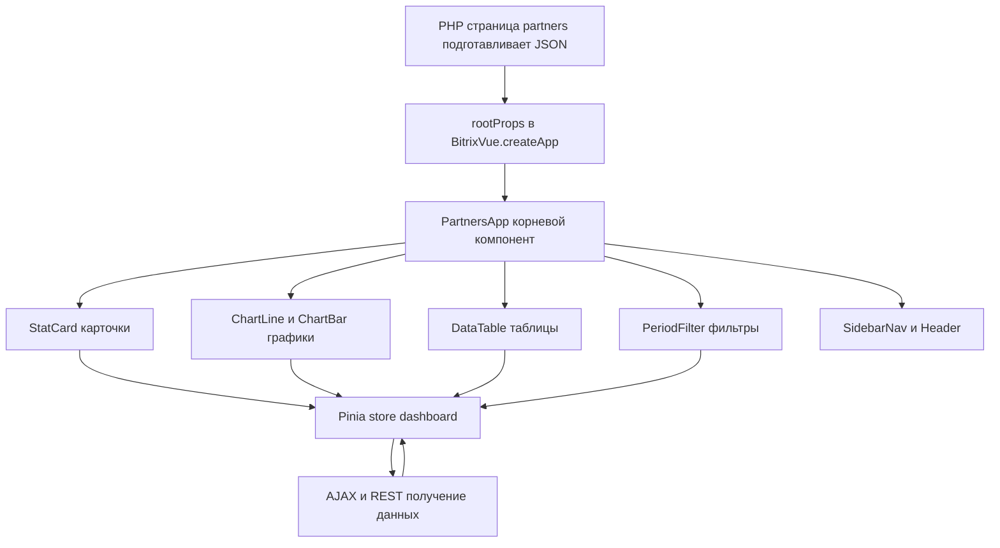

# План внедрения BitrixVue 3 в проект riba

Дата: 2026-08-04 (обновлено с учётом партнёрского кабинета). Документ: план перевода интерактивных блоков сайта на Vue 3 (BitrixVue).

---

## 1. Цель

Перевести на **BitrixVue 3** интерактивные блоки проекта. **Основной целевой блок — партнёрский кабинет** (`/partners/`): там планируются графики, таблицы статистики, дашборды — это классический кейс для реактивного SPA-подхода. Оформление заказа и карточка товара — следующие кандидаты (опционально, позже).

> **Архитектурный принцип: MVVM.** Vue.js реализует паттерн **Model-View-ViewModel**:
> - **Model** — данные из Bitrix (PHP-компоненты, AJAX/REST, `rootProps`);
> - **ViewModel** — реактивное состояние компонентов (data/computed/store Pinia), которое обновляет View при изменении Model;
> - **View** — декларативные шаблоны (`{{ }}`, `v-for`, `v-if`, `@click`).
> Двусторонняя связь View ↔ ViewModel обеспечивается автоматически (реактивность), а связь ViewModel → Model — через вызовы методов/AJAX. Это требование заложено во все этапы ниже: никаких прямых ручных манипуляций с DOM в новых блоках.

## 2. Текущее состояние (что изучено)

- **Vue в проекте не используется** — 0 совпадений `ui.vue3` / `BX.Vue3` / `BitrixVue` в `local/`.
- **Расширений** (`local/js/`) нет. Сборщик `@bitrix/cli` не установлен (нет `package.json`/`node_modules`).
- Установка Битрикса содержит полный `ui.vue3`: ядро, `pinia`, `router`, `vuex`, готовые компоненты (`button`, `hint`, `popup`, `switcher`, `audioplayer`, `socialvideo`, `reactions`, `smiles`, `rich-menu`, `rich-loc`), файл типов `ui.vue3.d.ts`.

### Партнёрский кабинет (главный кандидат)
- Отдельный шаблон [`local/templates/partners/header.php`](local/templates/partners/header.php:1): свои CSS/JS (jQuery, `main.js`, [`partners/script.js`](partners/script.js:1) ~25 КБ).
- Дашборд [`partners/index.php`](partners/index.php:66): стат-карточки (доход, заказы, % изменения) — сейчас статические цифры.
- Активные разделы: [`delivery-zones/index.php`](partners/delivery-zones/index.php:1) (~50 КБ), [`delivery-zones/restorany/index.php`](partners/delivery-zones/restorany/index.php:1), [`menu/`](partners/menu/index.php:1), [`settings/index.php`](partners/settings/index.php:1), [`settings/dostavka/index.php`](partners/settings/dostavka/index.php:1).
- **Заглушки под будущие Vue-блоки:** [`statistics/index.php`](partners/statistics/index.php:1) («Text here....»), [`zakazy/index.php`](partners/zakazy/index.php:1), [`finansy/index.php`](partners/finansy/index.php:1), [`otchety/index.php`](partners/otchety/index.php:1) — сюда лягут графики/таблицы.

### Остальные кандидаты (опционально, позже)
| Блок | Компонент | Объём JS | Риск |
|---|---|---|---|
| Мини-корзина в шапке | `bitrix:sale.basket.basket.line` (`header-cart`) | малый | низкий |
| Карточка товара | `bitrix:catalog.item` (`fisheat_app/.../item`) | script.js ~64 КБ | средний |
| **Оформление заказа** | `opensource:order` (`oformlenie-zakaza/index.php`) | script.js 3385 строк | высокий |

---

## 3. Стратегия

**Принцип: поэтапно, от малого к большому, без остановки работы сайта.** На каждом этапе старый код остаётся рабочим, новый включается точечно.

### Ключевые решения
1. **Способ подключения Vue** — штатный: расширение `local/js/<module>/<ext>/` + сборка `@bitrix/cli` (ES6+, модульность, автокомплит). Требует установки Node.js + `@bitrix/cli`.
   - Промежуточно (без сборки): глобальный `BX.Vue3.BitrixVue` на PHP-странице.
2. **Данные** — PHP-страницы готовят JSON (статистика, заказы, настройки) и передают в приложение через `rootProps`; обновления — через AJAX/REST.
3. **Паттерн «Контроллер + Компоненты»** — контроллер управляет жизненным циклом приложения, компоненты только отображают данные и шлют действия.
4. **Состояние** — Pinia (`ui.vue3.pinia`) для дашборда: фильтры, период, данные графиков/таблиц.
5. **Графики** — внешняя библиотека (Chart.js / amCharts / uPlot) подключается как Bitrix JS Extension (по разделу «Внешние библиотеки» документации) либо готовая из Битрикса, если найдётся в установке.
6. **Интеграции** — `$Bitrix.Loc` (фразы), `$Bitrix.eventEmitter` (события), `$Bitrix.Application`.
7. **Отладка** — `define('VUEJS_DEBUG', true)` в `local/php_interface/init.php` (dev) + Vue DevTools.

---

## 4. Этапы работ

### Этап 0. Подготовка окружения
- [ ] Установить Node.js и `@bitrix/cli`; проверить `bitrix --version`.
- [ ] Создать структуру расширения `local/js/ldo/vue-app/` (`src/`, `dist/`, `bundle.config.js`, `config.php`).
- [ ] Проверить доступность `ui.vue3` в админке (версия ui ≥ 22.100.0).
- [ ] В `local/php_interface/init.php` включить `VUEJS_DEBUG` (dev).
- [ ] Собрать demo-приложение «Hello World» и смонтировать на тестовой странице — проверить работу + DevTools.

### Этап 1. Пилот: мини-корзина в шапке (обкатка интеграции, низкий риск)
- [ ] Взять шаблон `bitrix:sale.basket.basket.line` (`header-cart`).
- [ ] Передать данные корзины в `rootProps` (через `result_modifier`/`component_epilog`).
- [ ] Vue-компонент: кол-во позиций, сумма, ссылка на корзину.
- [ ] Реактивное обновление через `$Bitrix.eventEmitter` и штатный AJAX.
- [ ] Проверить на шаблонах `fisheat` и `fisheat_app`.

### Этап 2. Партнёрский кабинет — инфраструктура Vue
- [ ] В шаблон `partners` добавить подключение расширения (`Extension::load`) и контейнер `
`.
- [ ] Создать `PartnersApp` (корневой компонент) + контроллер; прокинуть данные дашборда через `rootProps`.
- [ ] Определить структуру компонентов:
  - `StatCard` (стат-карточка: значение, % изменения)
  - `ChartLine` / `ChartBar` (графики — обёртка над выбранной библиотекой)
  - `DataTable` (таблицы статистики: сортировка, фильтры, пагинация)
  - `PeriodFilter` (переключатель периода: день/неделя/месяц)
  - `SidebarNav` / `Header` (меню и шапка кабинета)
- [ ] Pinia store `dashboard`: период, фильтры, данные карточек/графиков/таблиц.

### Этап 3. Партнёрский кабинет — наполнение данными
- [ ] Подготовить PHP-бэкенд: методы/компоненты, возвращающие JSON (статистика продаж, заказы, финансы, отчёты) из БД.
- [ ] Заполнить страницы-заглушки: [`statistics/`](partners/statistics/index.php:1), [`zakazy/`](partners/zakazy/index.php:1), [`finansy/`](partners/finansy/index.php:1), [`otchety/`](partners/otchety/index.php:1).
- [ ] Обновлять данные без перезагрузки (AJAX-обновление графиков/таблиц при смене фильтров).
- [ ] Вынести фразы кабинета в `lang/ru`, использовать `$Bitrix.Loc.getMessage`.
- [ ] Интерактив дашборда [`partners/index.php`](partners/index.php:66) перевести на Vue (стат-карточки из данных, а не хардкод).

### Этап 4. Партнёрский кабинет — остальные разделы (по мере необходимости)
- [ ] `menu/` (товары, разделы, синхронизация), `settings/` (настройки, доставка) — формы и таблицы на Vue.
- [ ] `delivery-zones/` (зоны доставки, рестораны) — карта/списки/редактирование (аккуратно: 50 КБ PHP, большой объём).

### Этап 5. (Опция) Оформление заказа на Vue
- [ ] Вынести из `class.php` JSON-модель (корзина, адреса, доставки, рестораны, бонусы, подарки) → `rootProps`.
- [ ] Компоненты: `BasketList`, `AddressBlock` (Яндекс.Карты), `DeliveryBlock`, `SummaryBlock`, `GiftBlock`.
- [ ] Pinia store `order`; AJAX-пересчёты — через существующие методы `ajax.php` компонента.
- [ ] Отключить старый jQuery-скрипт (`script.js` 3385 строк), оставить fallback-шаблон.

### Этап 6. Стабилизация и перенос
- [ ] Тестирование сценариев, отладка (DevTools, `VUEJS_DEBUG`).
- [ ] Оптимизация: `defineAsyncComponent` для тяжёлых блоков (графики, карты, модалки).
- [ ] Производительность: размер бандла, число запросов.
- [ ] Перенос проверенного подхода на `mobile_app/` при необходимости.

---

## 5. Риски и как их закрываем
- **Нет сборщика** → Этап 0; временно глобальный `BX.Vue3` без сборки.
- **Выбор библиотеки графиков** → проверить, что уже есть в установке (ui-модуль), иначе подключить внешнюю как Extension.
- **Данные для дашборда** → кабинет частично на заглушках; нужен PHP-бэкенд для JSON (отдельная подзадача Этапа 3).
- **Большой объём `delivery-zones` (50 КБ)** → переводить последним и по частям.
- **Регрессии заказа** → Vue только оборачивает существующие AJAX-методы; старый шаблон остаётся fallback.
- **Локализация/события** → штатные `$Bitrix.Loc` и `$Bitrix.eventEmitter`.

---

## 6. Схема целевой архитектуры (партнёрский кабинет)

