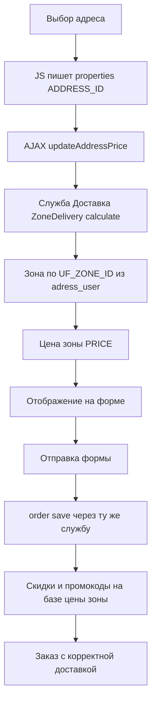

# План: стоимость доставки по зоне — применять на бэкенде заказа

## 1. Скоуп (только это сейчас)
- Стоимость доставки при выбранном адресе берётся из зоны доставки и **применяется на бэкенде при сохранении заказа**, а не только подменяется на фронтенде.
- Типы доставки штатные: «Доставка» и «Самовывоз» (стандартные службы Bitrix). Новых типов/служб не создаём.
- Время доставки и пороги (мин. заказ / бесплатная доставка) — **вне этого этапа** (позже).

## 2. Что уже есть (изучено)
- `local/components/opensource/order/class.php`:
  - `updateDeliveryPriceAction()` — по `addressId` берёт `UF_PRICE` адреса из HL `adress_user`; **если `UF_PRICE == 0`** — `findDeliveryPriceByCoordinates()` по зонам `DeliveryZoneTable`. Кладёт цену в сессию `LDO_DELIVERY_PRICE` (только для отображения).
  - `updateAddressPriceAction()` — аналогично, `deliveryPrice` приходит с фронтенда.
  - `executeComponent()` / `ajax.php::saveOrderAction()` → `createVirtualOrder()` → `setOrderProperties()` → `createOrderShipment($deliveryId)` → `order->save()`.
- **Когда `UF_PRICE` = 0 (и срабатывает поиск зоны по координатам):**
  - поле `UF_PRICE` не заполнено у адреса (старые адреса / не заполняли);
  - есть координаты `UF_SHIRINA`/`UF_DOLGOTA` → `findDeliveryPriceByCoordinates()`: точка внутри активной зоны → цена `PRICE` зоны; вне всех зон → `0`;
  - нет координат → цена остаётся `0`.
- **Важный разрыв:** при добавлении адреса `addAddressAction()` жёстко ставит заглушки `UF_PRICE => 321`, `UF_MINIMAL_SUM => 323212`, `UF_FREE_DELIVERY => 500` — т.е. у новых адресов `UF_PRICE` это НЕ цена зоны, а константа. Цена зоны в текущем флоу используется только когда `UF_PRICE == 0`. Кроме того, фронтенд `updateAddressInfo()` вызывает AJAX `updateAddressPrice` только если `data-price != 0` — при `UF_PRICE = 0` цена по зоне даже не запрашивается.
- **Проблема:** при `order->save()` Bitrix пересчитывает цену отгрузки через `$obDelivery->calculate($shipment)` стандартной службы «Доставка». Цена зоны в заказ не попадает. Скидки/промокоды/правила корзины начисляются от «неправильной» базовой цены доставки.
- Источники: таблица зон `ldo_delivery_zones` (`DeliveryZoneTable`: `PRICE`, `SITE_ID`, `ACTIVE`, `COORDINATES`); HL-блок адресов `adress_user` (`Hlblock::getAdressList()`: `UF_ZONE_ID`, `UF_SHIRINA`, `UF_DOLGOTA`, `UF_PRICE`).
- Адрес уже привязан к зоне: при добавлении/обновлении адреса `Hlblock::addAddress/updateAddress` проставляет `UF_ZONE_ID` через `findZoneIdByCoordinates()`.

## 3. Решение

### Обязательное предусловие: адрес вне зоны нельзя добавить
Адрес, не входящий ни в одну активную зону доставки, **не сохраняется** — иначе у него нет зоны, а значит, нет цены доставки. Сейчас это не так: `Hlblock::addAddress` проставляет `UF_ZONE_ID` только если зона найдена, но адрес вне зоны всё равно добавляется (без зоны). Это нужно исправить (см. шаг 0).

### Ключевая идея
Сделать зону источником цены доставки для службы «Доставка» на бэкенде: при расчёте/сохранении заказа служба «Доставка» возвращает цену зоны выбранного адреса. Тогда:
- и отображение (`OrderHelper::calcDeliveries`, AJAX),
- и сохранение заказа (`order->save()`),
- и применение скидок/промокодов на доставку

будут работать от одной и той же цены зоны.

### 3.1. Основной вариант (рекомендуется): кастомный расчёт в существующей службе «Доставка»
Службы не создаём — меняем обработчик у существующей «Доставка»:
1. Класс `Ldo\Deliverymap\DeliveryServices\ZoneDelivery extends \Bitrix\Sale\Delivery\Services\Base`, метод `calculate(\Bitrix\Sale\Shipment $shipment)`:
   - взять выбранный адрес: из свойства заказа `ADDRESS_ID` (новое скрытое свойство), fallback — «отмеченный» адрес пользователя (`Hlblock::getAdressList()`);
   - определить зону: `UF_ZONE_ID` адреса → `DeliveryZoneTable::getById()`; если нет — `Hlblock::findZoneIdByCoordinates(lat, lon)`;
   - вернуть `$result->setPrice(zone['PRICE'])` (и, опционально, положить `ZONE_ID` в `$result->setData()`).
2. Зарегистрировать обработчик событием `onSaleDeliveryHandlersBuildList` (модуль `ldo.deliverymap`) — служба появится в списке обработчиков в админке.
3. У службы «Доставка» в админке выставить `CLASS_NAME` на этот класс (или прописать в `b_sale_delivery_srv`). «Самовывоз» не трогаем.

### 3.2. Запасной вариант (проще): задать цену отгрузки перед сохранением
В `executeComponent()` и `saveOrderAction()` перед `order->save()`:
- вычислить цену зоны по выбранному адресу (переиспользовать логику зон);
- `$shipment->setBasePriceDelivery($zonePrice)` + `$shipment->setField('PRICE_DELIVERY', $zonePrice)`.
Минус: дисконтный движок Bitrix при пересчёте может перезаписать цену; потребуется проверка и, возможно, хук `onSaleOrderBeforeSaved`. Менее надёжно, чем вариант 3.1.

## 4. Шаги реализации (по 3.1)
0. **Запрет адреса вне зоны** — в `addAddressAction()` и `editAddressAction()` перед сохранением определять зону по координатам (`Hlblock::findZoneIdByCoordinates(lat, lon)`); если зона не найдена — возвращать ошибку «Адрес не входит в зону доставки» и **не сохранять** адрес. При редактировании координат — та же проверка (сейчас `editAddressAction` координаты не меняет, но `Hlblock::updateAddress` уже пересчитывает `UF_ZONE_ID`).
1. **Свойство `ADDRESS_ID`** — добавить скрытое свойство заказа (код `ADDRESS_ID`), чтобы бэкенд знал выбранный адрес.
2. **Форма/JS**: в `form.php` вывести скрытое поле `properties[ADDRESS_ID]`; в `initAddressSelect()`/`updateSelectedInfoDisplay()` проставлять `data-id` выбранного адреса (аналог `properties[RESTAURANT_ID]`); при самовывозе — очищать.
3. **Класс `ZoneDelivery`** (п.3.1) в модуле `ldo.deliverymap`: расчёт цены по зоне выбранного адреса.
4. **Подключение**: `onSaleDeliveryHandlersBuildList` + `CLASS_NAME` у службы «Доставка».
5. **AJAX-методы** `updateDeliveryPriceAction`/`updateAddressPriceAction`: заменить ручной поиск цены + сессию `LDO_DELIVERY_PRICE` на расчёт через службу `ZoneDelivery::calculate()` (виртуальный заказ со свойством `ADDRESS_ID`) — чтобы фронтенд показывал ровно ту цену, что уйдёт в заказ.
6. **Проверка консистентности**:
   - выбрать адрес → цена доставки на форме = цене зоны;
   - оформить заказ → в сохранённом заказе `PRICE_DELIVERY` = цене зоны;
   - промокод/скидка на доставку применяется от цены зоны.

## 5. Схема


## 6. Открытые вопросы
1. Каким способом определять службу «Доставка»: по ID (константа), по имени «Доставка», или вручную настроить `CLASS_NAME` в админке?
2. Защитный fallback в `ZoneDelivery::calculate()` для адреса без зоны (старые адреса / невалидные): цена 0, ошибка «Доставка в эту зону недоступна», или цена по умолчанию? (штатно таких адресов быть не должно после шага 0)
3. Оставлять ли сессию `LDO_DELIVERY_PRICE` как кэш для отображения или полностью убрать?
4. Нужно ли сразу на фронтенде (в модалке добавления адреса) проверять, что точка входит в зону, и показывать ошибку — или достаточно бэкенд-валидации в `addAddressAction`?

## 7. Детальные шаги реализации (пункт 3.1)

### 7.1. Класс службы доставки `ZoneDelivery`
- Новый файл: `local/modules/ldo.deliverymap/lib/DeliveryServices/ZoneDelivery.php`
- Пространство имён: `Ldo\Deliverymap\DeliveryServices`, класс `extends \Bitrix\Sale\Delivery\Services\Base`.
- Регистрация автозагрузки: в `local/modules/ldo.deliverymap/include.php` добавить в `Loader::registerAutoLoadClasses`:
  ```php
  'Ldo\\Deliverymap\\DeliveryServices\\ZoneDelivery' => 'lib/DeliveryServices/ZoneDelivery.php',
  ```
- Обязательные методы:
  - `public static function getClassTitle(): string` → «Доставка по зонам»;
  - `public static function getClassDescription(): string` → описание;
  - `public function calculate(\Bitrix\Sale\Shipment $shipment): \Bitrix\Sale\Delivery\CalculationResult`.

Логика `calculate()`:
1. `$result = new \Bitrix\Sale\Delivery\CalculationResult();`
2. Проверить `Loader::includeModule('ldo.deliverymap')` и `('ldo.develop')`; иначе `$result->addError(...)` и вернуть.
3. Определить выбранный адрес:
   - из свойства заказа `ADDRESS_ID` (перебор `$shipment->getParentOrder()->getPropertyCollection()`, поиск по `CODE === 'ADDRESS_ID'`);
   - если пусто — fallback на «отмеченный» адрес пользователя (`Hlblock::getAdressList()` → первый с `CHECKED`);
   - если адреса нет — `$result->addError('Адрес доставки не выбран')`.
4. Определить зону:
   - загрузить запись `adress_user` по ID (выбрать `UF_ZONE_ID`, `UF_SHIRINA`, `UF_DOLGOTA`, `UF_PRICE`);
   - если `UF_ZONE_ID > 0` → `DeliveryZoneTable::getRowById($UF_ZONE_ID)`;
   - иначе если есть координаты → `Hlblock::findZoneIdByCoordinates(lat, lon)` → `getRowById`;
   - если зоны нет → `$result->addError('Адрес не входит в зону доставки')`.
5. Цена: `$result->setDeliveryPrice((float)$zone['PRICE'])` (ставит и базовую, и итоговую — от базы корректно считаются скидки).
6. Данные для шаблона/AJAX: `$result->setData(['ZONE_ID' => ..., 'ZONE_NAME' => ..., 'PRICE' => ...])`.
7. Время (вне скоупа, но задел): `$result->setPeriodDescription(...)` — не делаем на этом этапе.

### 7.2. Подключение к существующей службе «Доставка»
- Вариант А (админка): Магазин → Настройки → Службы доставки → служба «Доставка» → обработчик/класс `Ldo\Deliverymap\DeliveryServices\ZoneDelivery`.
- Вариант Б (программно, миграция): найти службу по `\Bitrix\Sale\Delivery\Services\Table::getList(['select' => ['ID','NAME','CLASS_NAME'], 'filter' => ['=ACTIVE' => 'Y']])`, выбрать не «Самовывоз», выполнить `Table::update($id, ['CLASS_NAME' => \Ldo\Deliverymap\DeliveryServices\ZoneDelivery::class])`.
- «Самовывоз» не трогаем (цена 0 остаётся).

### 7.3. Свойство заказа `ADDRESS_ID`
- Добавить свойство заказа с кодом `ADDRESS_ID` (тип строка, служебное `UTIL=Y`, не показывать в форме, не обязательное) для нужного типа плательщика (`PERSON_TYPE_ID`).
- Сделать через админку (Магазин → Свойства заказа) или программно (`CSaleOrderProps->Add`).
- Т.к. блок `.hidden-fields` в `form.php` выводит все свойства, `properties[ADDRESS_ID]` появится в форме автоматически (проверить, что оно не скрыто как UTIL — при необходимости вывести отдельным `<input type="hidden" name="properties[ADDRESS_ID]">`).

### 7.4. Фронтенд: запись выбранного адреса
- `local/templates/fisheat/components/opensource/order/order-page/script.js`:
  - в `initAddressSelect()` и `updateSelectedInfoDisplay()` при выбранном адресе: `document.querySelector('input[name="properties[ADDRESS_ID]"]').value = <data-id адреса>`;
  - при самовывозе — очищать `properties[ADDRESS_ID]`.

### 7.5. AJAX-методы — привести к расчёту через службу
- `local/components/opensource/order/class.php`:
  - `updateDeliveryPriceAction()` / `updateAddressPriceAction()`: вместо ручного чтения `UF_PRICE` + `findDeliveryPriceByCoordinates()` + сессии `LDO_DELIVERY_PRICE` — строить виртуальный заказ (`createVirtualOrder`, `setOrderProperties` со `ADDRESS_ID`, `createOrderShipment($deliveryId)`), брать shipment и `$obDelivery->calculate($shipment)->getPrice()` (это и есть цена зоны из службы). Сессию оставить только как кэш для отображения (или убрать — по решению).
- Это гарантирует, что фронтенд показывает ровно ту цену, что уйдёт в заказ.

### 7.6. Убрать заглушки и привязать адрес к зоне
- В `addAddressAction()` (`class.php` ~1198): убрать жёсткие `UF_PRICE => 321`, `UF_MINIMAL_SUM => 323212`, `UF_FREE_DELIVERY => 500` (цена доставки теперь от зоны). Цену зоны в адрес не писать.
- `Hlblock::addAddress` уже проставляет `UF_ZONE_ID` при наличии зоны.

### 7.7. Запрет адреса вне зоны (шаг 0)
- В `addAddressAction()` и `editAddressAction()`: перед сохранением `Hlblock::findZoneIdByCoordinates(lat, lon)`; если `0` → ответ `{success: false, error: 'Адрес не входит в зону доставки'}` и НЕ сохранять.

### 7.8. Проверка (checklist)
1. Адрес в зоне добавляется, `UF_ZONE_ID` заполнен; адрес вне зоны — ошибка, не сохраняется.
2. Выбран адрес → на форме цена доставки = `PRICE` зоны (и совпадает между `updateDeliveryPrice` и `updateAddressPrice`).
3. Оформление заказа → в заказе `PRICE_DELIVERY` = цене зоны; `BASE_PRICE_DELIVERY` тоже.
4. Промокод/скидка на доставку применяется от цены зоны (проверить в админке заказа и в расчёте).
5. Самовывоз → цена доставки 0, `ADDRESS_ID` очищен.
6. Регресс: смена количества/товара в корзине не ломает расчёт (единый ответ `prepareBasketResponse` использует `getDeliveryPrice()` из сессии — сверить с ценой зоны).
